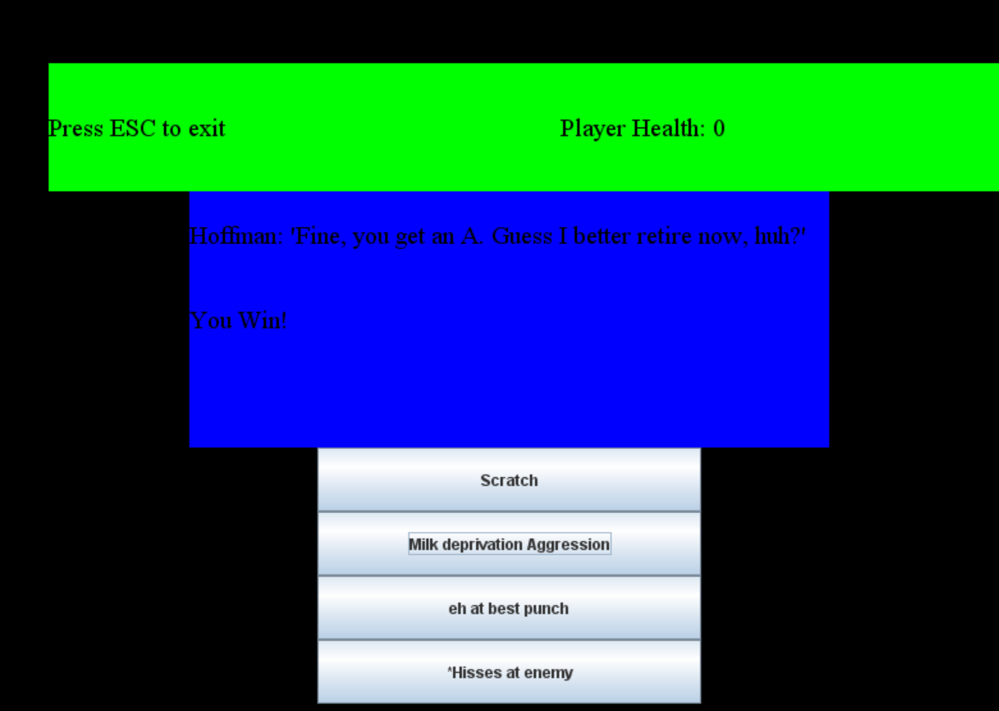

# Navigation Structure
{: .no_toc }

## Table of contents
{: .no_toc .text-delta }

1. TOC
{:toc}

---

# Bug Report
###### revised December 2020 by Team A5

Below is a list of known bugs and oddities in the game code.
There are definitely more bugs than what is listed here...they just haven't been discovered yet.

## White color rgb(255,255,255) is transparent

I am not quite sure why this is, but if an image uses the color white with the rgb (255,255,255), the color will be
transparent when loaded in. I think it has to do with the way the `transformColorToTransparency` method works (which I lifted
from a StackOverflow answer) that I use in order to set a transparent color in an image when loading it in (the default transparent color
is magenta rgb (255,0,255)). Maybe there's a better transparency method out there that doesn't have this adverse effect on the color white?

The good news is this is super easy to work around -- just use a white color with a different rgb in your images, such as (255,255,254) (which will look
no different in game than (255,255,255) I promise). Off the top of my head, the `Walrus.png` image uses this technique for its tusks because
pure white wouldn't show, which is how I found out about this bug.

## Moving the player with arrow keys doesn't override previous key press properly (updated)

In the original game, if you held the key to walk right and then walk left, it would override the walking to the right, but not vice versa. To fix it,
we made it so that if both are being held, then the player will stand still. This is okay, but still not as ideal as having the inputs override eachother
properly as was originally intended. This would require having to note which way the player was moving before both keys were down simultaneously.

## Enemies and enhanced map tiles don't update off screen
While this is made to be an optional thing via the code, it feels weird when an enemy suddenly reappears at it's spawn point the way they're used in the
game right now, and even weirder when a moving platform respawns. This is easily fixed by setting the Enemy-specific variables mentioned in the Enemies
section to the desired values, so it shouldn't be too much of a hassle.

## Holes are not allowed

As it currently stands there is nothing to detect if you fall in a hole through the bottom of the level. As such, if a hole is placed in the map and the
player falls into it, the player will fall endlessly and thus prevent the game from being playable without forcibly restarting. This is far from ideal,
as it limits the map design potential. While not necessary, this could possibly be fixed by either checking to see if the player is touching the map
or by putting something outside the map boundaries under the hole that kills the player.

## Moving Platform grants immunity

This can be seen in MapS4, where the moving platform takes the player through some spikes that they are meant to jump over. However, for some reason when
the player is riding a moving platform through the spikes the hurtboxes just don't kill the player. This definitely should not happen, although we don't
really have any ideas on how to fix it other than to just not design a level that has a platform moving through spikes or such, which is kind of a lame fix.

## Final boss exit difficulties

In the final boss battle it says "press ESC to exit". However, this hotkey doesn't really work, and thus the player is stuck at the end of the battle
forever until they manually terminate the program. This is definitely not ideal, since you'd want the game to either go back to the main menu upon completion
or run through some type of ending scene. Fixing this by reimplementing the battle in a more engine-friendly class will go a long wyas ttoweds solving this.

