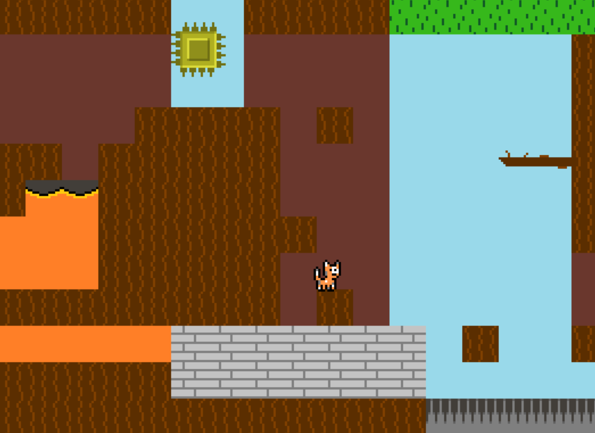
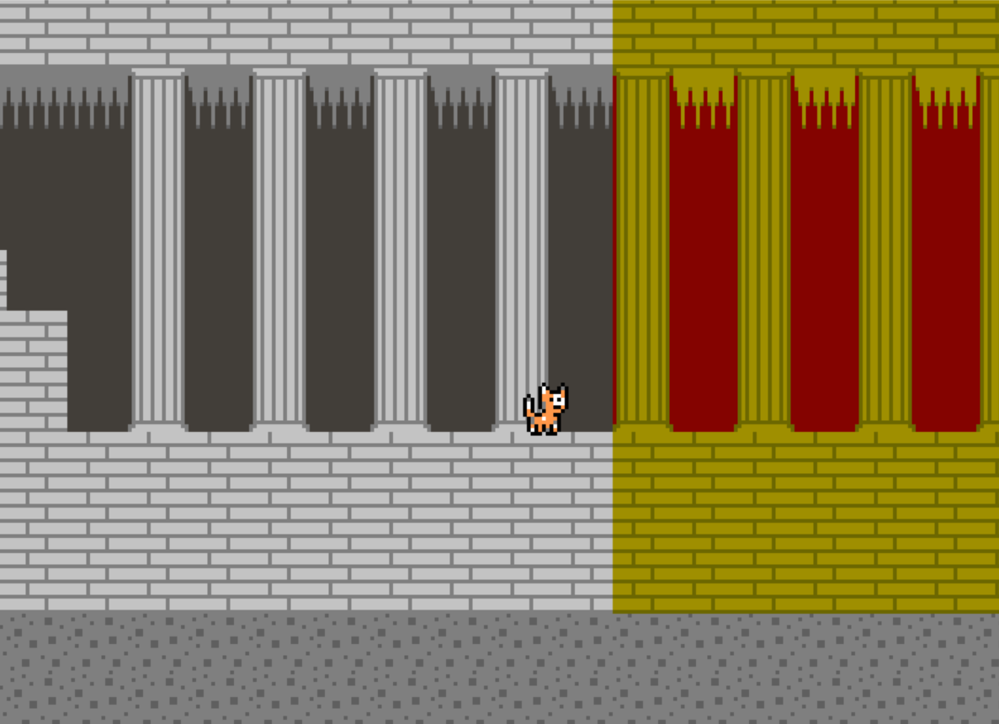

# Navigation Structure
{: .no_toc }

## Table of contents
{: .no_toc .text-delta }

1. TOC
{:toc}

---

# Enhancement Ideas
###### revised December 2020 by Team A5

Below is a list of potential enhancement ideas that could be made to this game. (All sections in first person were written by Prof. Alex)

## More NPC's/Tutorials

Right now the Walrus NPC used in the Test map is never used anywhere else in the game, nor are there any other NPC's used save
for the final boss sprite. Along with this, the game has no tutorial telling you what hurts you, what instantly kills you, and
what is completely harmless. Adding NPC's to tell the player certain things or to interact with in general will make the game
more accessible to players and require them to do less stressful guesswork.

## Full map resets

When the player loses a life, they get sent back to the start of the map, but all the enemies they killed stay dead. This doesn't
make sense, as the whole level should be started over, including the enemies. Part of this is due to the fact that when lives were
added the typical "you've died" screen was saved for only final death rather than making one for simply losing a life as well.
Changing it so that the player either goes through a "you lost a life" screen before redoing the level or just doing something to
respawn the enemies when you lose a life should fix this. 

## More Tiles

Right now the game has one tileset (CommonTileset) which contains all the tiles used. These work fine, but some of them are
made with only certain areas in mind, like how lava only matches with the cave background, or flowers only match with the
blue sky (level N1 is a good example of this lacking in variations of the same tile). Adding more variations of existing tiles with new backdrops will allow for more options when making a level that
looks visually appealing and logical.

Another idea could be to separate different settings into completely different tilesets, say for instance a tileset for day
and a tileset for night, or maybe even one for each level theme (there'd be some repeated tiles between tilesets but that's fine).
This will make it a lot easier to work with a specific set of tiles for a certain level without sifting through the others,
though could backfire if you suddenly want one that's only in a different tileset. (which, I mean, you could just manually add
that one in).

Oh, and one specific note related to this: Right now the pillars are (very intentionally) able to be passed through and stood upon
(assuming it's the top pillar block). However, some people seemed to be under the impression that they were solid objects when making
their levels, which is honestly kind of understandable. Thus, perhaps making a solid pillar and a not solid pillar would be a good idea.
Just a thought.

## Lives/Health Display and Function

As of right now the health system is both very simple and very invisible to the player. The player currently starts each
level with 5 lives and 20 health, which goes down by one every time you bump an enemy (as indicated by the noise that
plays). Since there is no display at the top showing how much health and how many lives are left, the player is left in
the dark as to how close to death and/or total failure they are. Creating a health bar and lives counter would be a good
fix for this, but you would have to make sure they were constantly displayed at the top. Other options are to make new
sprite frames for the player to show them getting progressively more damaged, and having a mario-style screen show up
every time you die with the number of lives left. 

Another issue is how the lives reset after every level, meaning that you essentially get that many tries for *every
 level*. This is probably not for the best, and should be patched out somehow, likely by constantly keeping track of
 the lives in somewhere other than the player class itself.

## Slopes

Just putting this here to warn anyone that is interested in implementing slope map tile types into the game
that it is HARD and I don't recommend doing it without a solid understanding of how the game's map tile system works. 
There are so many ways to implement them with their own different pros and cons, and even games known for their
slopes like 2D Sonic the Hedgehog games have some bugs (you just don't notice them because in those games you move very fast).

## Improved jump mechanics

In nearly all platformer games, the player will jump at different heights based on how long the jump button is held.
I think this would make the controls feel a lot better, as the player jumping right now feels really high and it's impossible
to shorten the jump. Additionally, I think the jumping physics can definitely be updated/changed to feel a lot better. There are like
100 different ways to implement jump code all with different pros and cons, so it's definitely worth playing around with
and seeing if you can make the jumping feel better.

## Collectibles

What would Mario be without coins, let alone power-ups and other collectible items within the level? Adding some of these can
add more intrigue to the gameplay and reward the player for exploring otherwise pointless areas with stuff like bonus lives.
Who knows, you may even be able to do something with the coins, unlike classic Mario games.

## Story, and map design that shows it

Almost every notable platformer game out there has a story of some sort, and as of right now the closest thing to a plot this
game has is the fact that it stars an adjunct professor's cat going up against a swole version of another professor who by the time
you read this will be retired (make of that deep lore what you will). By adding story text between levels or even through NPC's
within the level the player feels a lot more like they're playing a game rather than an organized collection of levels.

On top of this, making the levels fit together well goes a long way towards making the game feel like a fluid story rather than
a bunch of assembled events. For example, if I end the level at the bottom of a dark cave and start the next level in on the
open fields, it doesn't make very much sense. Rather, have it so that the end or beginning of a level has you going into a certain
setting from the previous one or exiting the previous setting into the new one. The current game doesn't demonstrate this very well
since it was just a bunch of levels we made separately compiled together, but it has it's moments, like when 5I transitions from the
cave setting of N5 to the fortress setting of S5.

## Linear Difficulty Scaling

This is getting a lot more into techniques of good game design at this point rather than actual programming-related stuff, but it's
still worth mentioning. Having the game increase in difficulty as it progresses it pretty much the gold standard for any game
out there on the market. The first levels should be easy, and that should steadily change until the final levels are quite the
challenge.

I'll use N1 as an example again (sorry Nico); The first 3 levels before it are pretty straightforward and easy, and then
suddenly this level shows up,, requiring the player to make precisely timed jumps over lava and spike pits, not to mention a tight
jump out of a cave with a block over your head (which is still really easy to die to even after playing the game multiple times).
This kind of level probably shouldn't be seen until at least halfway through the game in it's current state, and novice players
encountering this level are gonna find themselves in for a world of hurt, probably enough so to quit the game out of frustration.

## Don't punish the player too much/make simple mistakes salvageable

Basically, don't design a level where the player gets unnecessarily punished for making a small slip-up. A small version of this is
when there are multiple paths for the player to explore, and one of them just goes to a long dead-end that forces the player to go
all the way back. If you're gonna make a long branching path, give it purpose (unless it's a maze level or something).

The other example is in N5 (again, sorry Nico), where the main difficulty of the level is making one tight jump over a spike. It
appears as if failing the jump and falling into the area beneath just means you have to go back around the long way. But, the spike
pit in the lower area is too long to even jump over because of how low the ceiling is. This reduces the entire level to "make this jump
or you lose a life each time you fail", which just really isn't fun and kinda steals the player's control from them. Now the game is
playing them, and that's the last thing we want to get out of user experience.

## Final boss improvement

As it stands the final boss battle is pretty dry: spam the strongest move to win. of course, by changing the way certain moves work
in terms of adding other effects for certain attacks like accuracy, variable damage, and limited uses, it might make the fight more
interesting. Being able to menu through different options like healing items, defending, or attacking (a la Pokemon) could also add
more strategy to this skeleton of a combat system.

On top of this, the current implementation of the levelBossScreen is not very ideal, since it creates a new panel with isolated
functionality that then requires a force exit (mentioned in the bugs section), rather than the way the menu screens and such like 
levelClearedScreen are implemented. Fixing this will allow the boss fight to flow smoothly with the rest of the game, and hey,
 maybe you can even add more bosses that function similarly!

If you're able to fix all of this, then adding a picture for the boss is highly recommended (you'll see our lovely image that we
attempted to add below. Not that you necessarily *have* to use it, but he's in the resources folder waiting
to be used, assuming you clean up the edges of the sprite).

