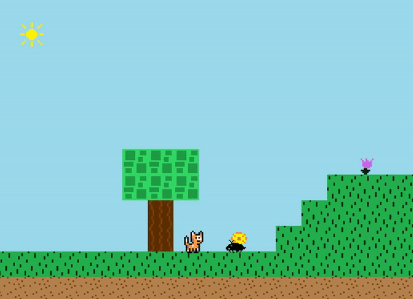

# Navigation Structure
{: .no_toc }

## Table of contents
{: .no_toc .text-delta }

1. TOC
{:toc}

---

# Player Win or Lose Level Logic
###### revised December 2020 by Team A5

The `Player` class has a `levelState` variable which it uses to determine if it is currently playing the level, completed the level,
or lost the level (died). Upon the `levelState` being set to either the `LEVEL_COMPLETED` or `PLAYER_DEAD` state,
different `update` logic will be run instead of the usual player traversing through the level.

## Player Win Logic -- Level Completed

When the player touches a `LevelEndBox` enhanced map tile, it will result in the player's `levelState` being set to `LEVEL_COMPLETED`.
When this happens, the `update` logic changes to use the `updateLevelCompleted` method. This method is what performs the "animation" where after the player hits
the `LevelEndBox`, it will fall to the ground, and then it will signify to the `PlayLevelScreen` that the level has been won. (the old build had a walking offscreen
animation we commented out due to the level boundaries preventing the player from walking off, and it only really working if the level ends on the edge of the screen)

## Player Lose Logic -- Player Dead
 
Upon losing a life, the player is sent back to the start of the current level, while retaining the level's instance (any killed enemies will stay dead).
When the player loses all their lives, it will result in the player's `levelState` being set to `PLAYER_DEAD`. When this hapens,
the `update` logic changes to use the `updatePlayerDead` method. This method is what performs the death animation where the player falls down until they go
off screen, at which point the `PlayLevelScreen` is notified that the player has died.

