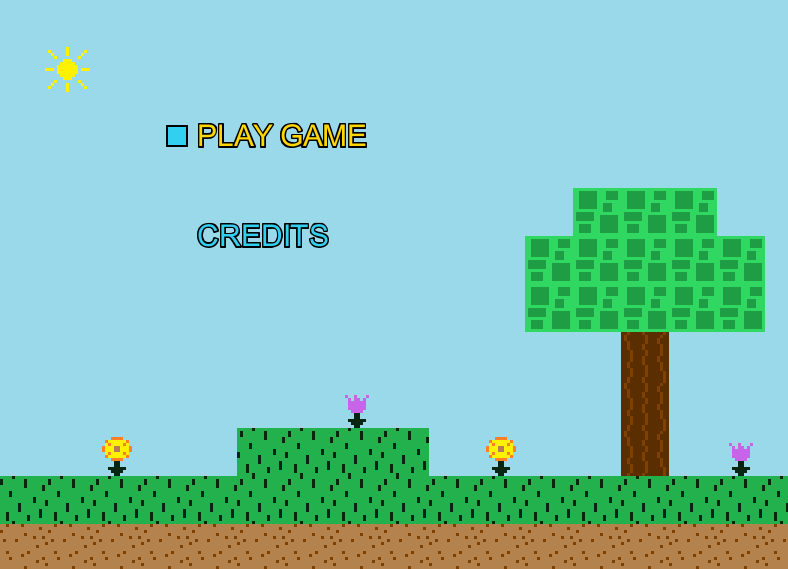
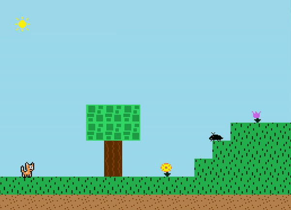
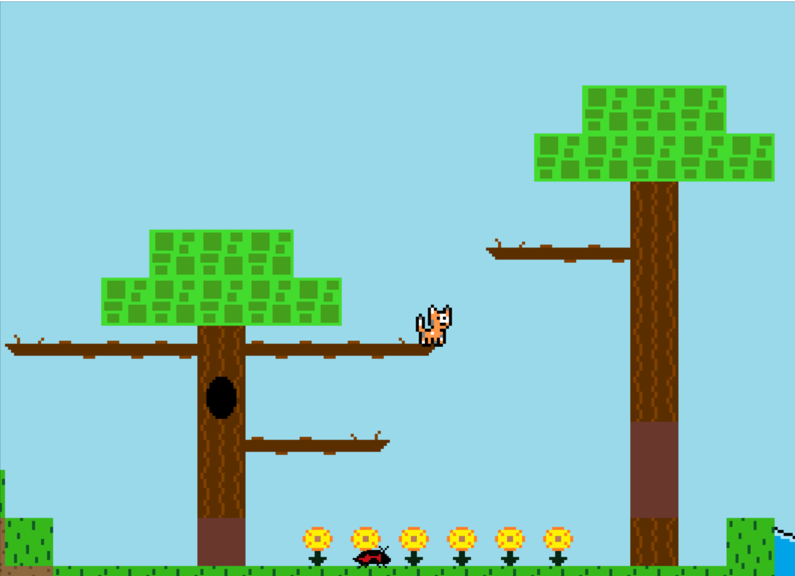

# Navigation Structure
{: .no_toc }

## Table of contents
{: .no_toc .text-delta }

1. TOC
{:toc}

---

# What is this game?
###### revised December 2020 by Team A5

This game (which has no title as of now) is a traditional platformer where you play as a cat and have to traverse from the beginning to the end of 
levels while mostly avoiding enemies. Upon hitting the gold box at the end of a level, the level is completed. Hitting an enemy results in taking damage, too much of which means the level must be restarted.
Too many deaths per level, and it's game over, sending you right back to square one.

Inspiration for this game came from popular 2D platformers such as Mario and Megaman. The player currently can walk around, jump, duck, and swim as standard to the genre,
and enemy/level design and graphics were heavily influenced by the games [Super Mario World](https://www.youtube.com/watch?v=ta7ufW0Prws) and [Megaman 2](https://www.youtube.com/watch?v=vuJ8Qr-3_zg).

The art direction was intended to create a "happy" vibe, and follows a blocky minimalistic style ~~because I am a horrible artist~~.
The sun shines, the flowers dance, and a bright color palette is used ~~which is totally not just the result of me only using Microsoft Paint default colors~~.

# Features

- 6 "Worlds" containing 4 levels each, plus a final stage containing the boss
- Two basic enemy types
- ~~One NPC that you can talk to~~ One boss NPC that you can NOT talk to (we didn't add any NPC's to our levels...)
- Player can walk, jump, duck, and swim
- Touching an enemy results in taking damage until you run out of health, after which you must restart the level
- The level is completed when the gold box at the end of the level is touched
- Tile map loader that supports both static and animated tiles
- Some interesting level set pieces like jump through platforms and moving platforms
- A map editor tool
- A menu, credits, and instructions screen

The menu screen can be navigated using the arrow keys and the space bar to select an option.

The player character (cat) can walk left and right using the A and D keys. Pressing the W key jumps, and pressing the
S key ducks. Note that depending on the type of keyboard your computer has, you may be limited to how many keys you can press at the same time.
If you find yourself being unable to jump when multiple other keys are pressed at once, it is a keyboard problem, not a coding/Java problem.

If you touch the gold box at the end of the level, the level will be completed. If you touch an enemy, you will take damage and eventually die and be forced to restart the level. Most of the map tiles
(grass, dirt, trees) are solid and can be jumped on but not jumped through. There are a few tiles like the tree branches and the moving platform which
can be jumped through and stood on (like typical jump through platforms that are common in the platforming genre).

Clearly, this game is not finished (that's *your* job now). There are many different directions the game can be taken in from here
even after being worked on for a whole semester by another team, and the backing game engine was built to support a wide variety of options that could be feasibly implemented.

# Tools used to make this game

This game was written in Java (version 8 or later) and uses no external libraries. It was developed using the IntelliJ IDE,
although it should work out of the box with any other Java IDEs such as Eclipse. 

All of the game's art was created from scratch using the almighty Microsoft Paint.

# Running the game

The game can be run like any other Java application by executing the program starting from the file with the main method. I recommend using
the IntelliJ IDE to run the application, however the Eclipse IDE will work fine as well.

The `main` method for the game is in the `Game` package > `Game.java` file.

The `main` method for the map editor is in the `MapEditor` package > `MapEditor.java` file. This is a separate program
from the game.

# Game Screenshots

Here is what the game looks like (beta build):

Menu Screen

In Game Screens (the player character is the adorable cat!)

Screenshots from the most recent build:

